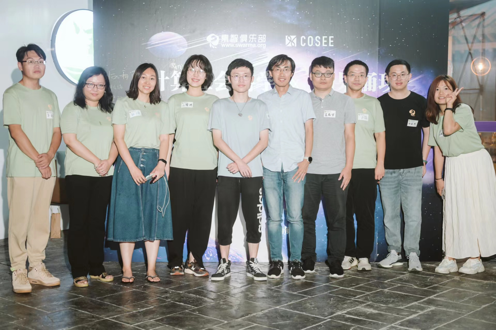
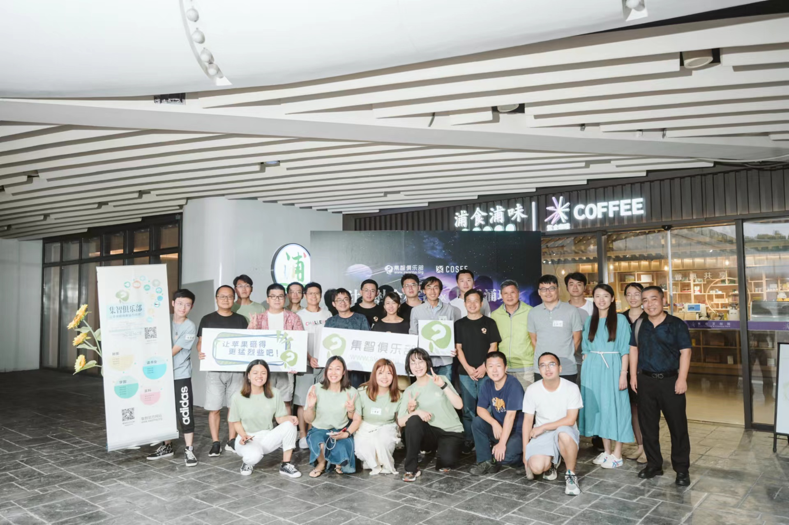
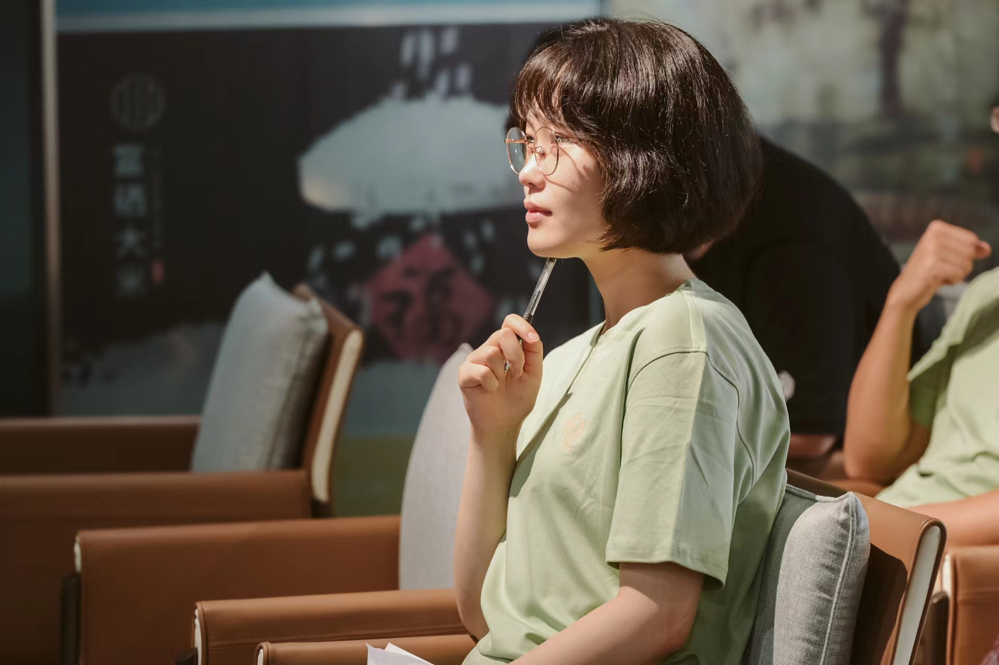

---
authors:
- admin
categories:
- About Me
date: "2020-12-13T00:00:00Z"
draft: false
featured: true
image:
  caption: 'Image credit: [**Unsplash**](https://unsplash.com/photos/CpkOjOcXdUY)'
  focal_point: ""
  placement: 2
  preview_only: false
lastmod: "2020-12-13T00:00:00Z"
projects: []
subtitle: ""
summary: ""
tags:
- Academic
- 开源
title: In Swarm Club
---

I’m an operation assistant at **Computational Social Science Websenimar in Swarm Club**. 

Swarm Club was founded by [Jiang Zhang](https://jake.swarma.org/), a professor at School of Systems Science, Beijing Normal University. Swarm Club is a group of explorers engaged in academic research and enjoying the fun of science. It is also the earliest scientific community in China to study **artificial intelligence and complex system**.

The Computational Social Science Websenimar was led by Luo Jiade from Tsinghua University and co-sponsored by Ph.D. students from Carnegie Mellon University, University of Michigan, Tsinghua University, and University of Pittsburgh. The Websenimar focused on **Graphs, Embedding, NLP, Modeling, data collection**, and their integration with social science issues. It also focused on topics such as prediction and interpretation, and research on COVID-19. 

From June 2022 to October 2022, I engaged in the operation of Computational Social Science Websenimar in Swarm Club. My work is mainly responsible for: 

  a. Contacted scholars from diverse backgrounds to facilitate research cooperation.  
  b. Led book club discussions; organized online and offline academic events.  
  c. **Contributed notes and learning materials on computational social science**, especially on the topic of **Information Diffusion, Attention Flow, and Reflection on the Logic of Computational Social Science**.  
  d. Encouraged members within the community to produce high-quality content.  
  e. **Planned and organized workshops and seminars on personal growth and academic development**, and invited guest speakers ([Hongbo Fang](https://scholar.google.com/citations?user=tMNsrlQAAAAJ&hl=zh-CN) from CMU and [Anfan Chen](https://scholar.google.com/citations?user=1Y4OvMIAAAAJ&hl=zh-CN) from CUHK) to share experiences about the academia and the industry.  
  
  
  

