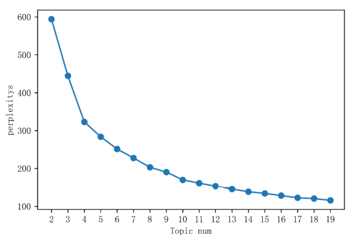
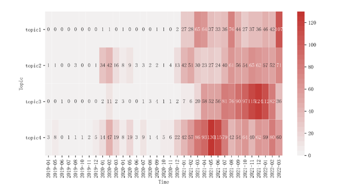
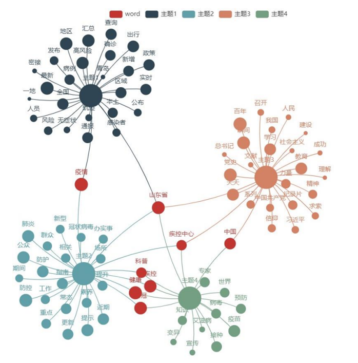

## Media attention flow of the CDC's WeChat official account "Shandong CDC" during the COVID-19: A thematic analysis based on Biterm Topic Model

This study used topic modeling to conduct a case study of WeChat official account “Shandong CDC”, introducing the agenda-setting theory. The titles of all articles published by Shandong CDC’s WeChat official account during COVID-19 pandemic was crawled. Biterm Topic Model was used to analyze the data. 
Logistic regression was applied to investigate the relationship between the agenda and public attention.  

The study found that the information released and highlighted on the WeChat official account "Shandong CDC" focused on epidemic prevention and control tips and public health literacy improvement, COVID-19 epidemic realtime updates and COVID-19 vaccination, and also released content about CPC’s building; the public devoted the most attention to the COVID-19 epidemic real-time updates. This paper adds to the research related to information dissemination on COVID-19 epidemic and provides suggestions for it during the epidemic.

**Related**:Topic Modeling; agenda setting; public attention
